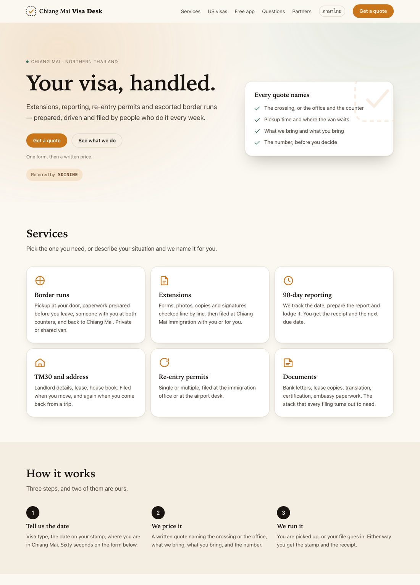
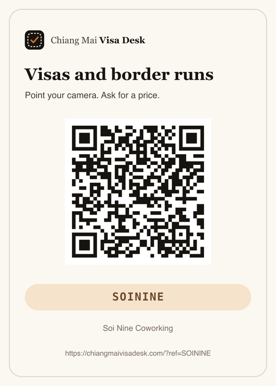
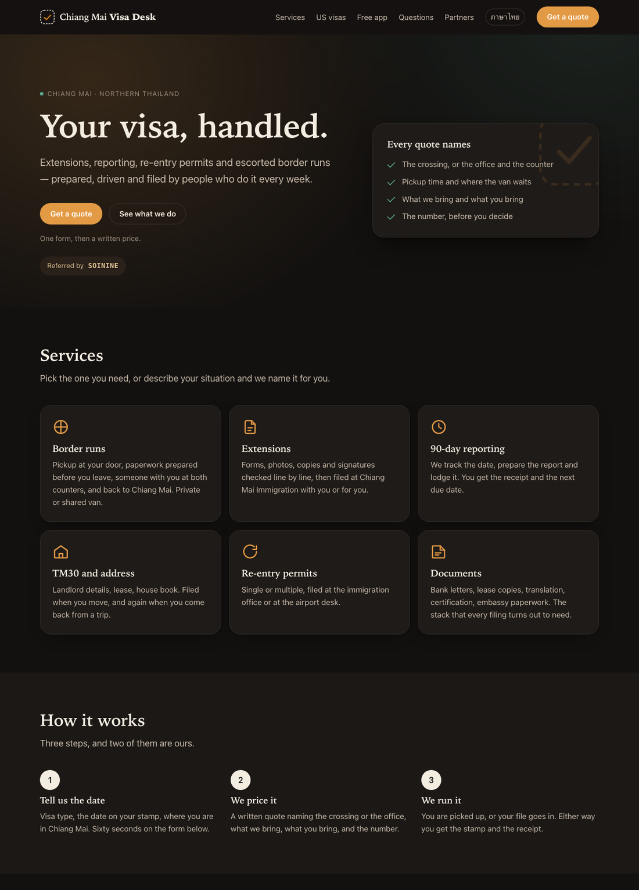
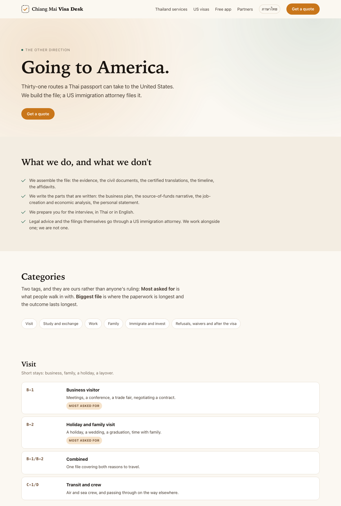
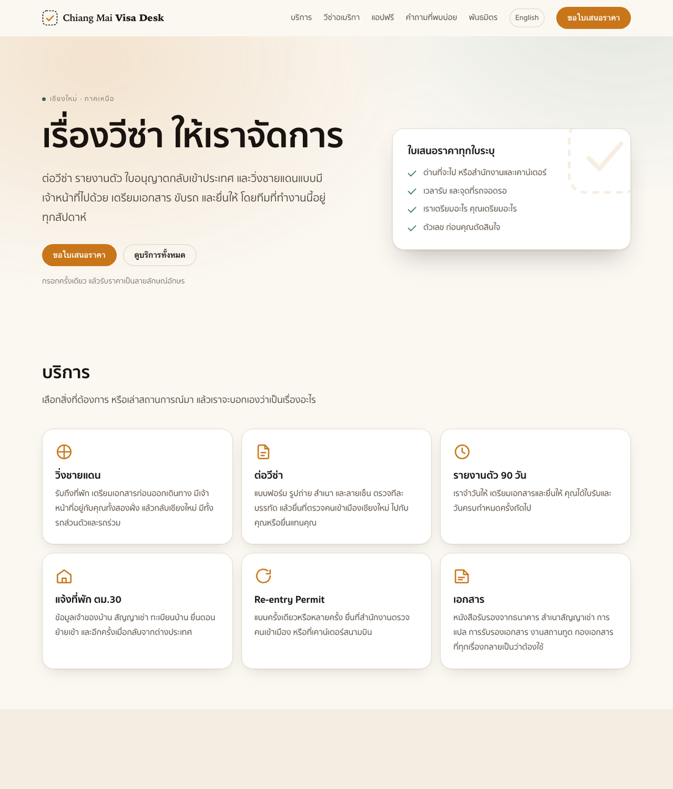

# Visa Desk

[](https://github.com/NaNoBotCo/visa-desk/actions/workflows/check.yml)
[](#sixty-seconds)
[](LICENSE)

A small, fast, near-buildless website for a visa service — in two languages,
with a 31-category visa catalogue, a free app to give away, and the referral
machinery that pays the people who send it customers.

Running at **[chiangmaivisadesk.com](https://chiangmaivisadesk.com)**. Clone it
for your own city in about a minute.



---

## Why you might clone this

- **No dependencies and no framework.** Handwritten HTML, one CSS file, one JS
  file. Open `site/index.html` and it works. One page — the visa catalogue — is
  generated from JSON by a stdlib script, and its output is committed.
- **Bilingual, properly.** English at the root, Thai under `/th/`, every page
  paired by `hreflang` in both directions and in the sitemap. A check fails the
  build if a pair breaks.
- **A visa catalogue from data.** Thirty-one categories in `data/us-visas.json`,
  rendered into both languages with tags, jump links and `OfferCatalog`
  structured data.
- **Attribution you cannot lose.** Every enquiry is stamped server-side with
  the site's own origin code, which the page is not allowed to set — so your
  commission does not ride on a query string surviving. Partner codes sit
  beside it rather than replacing it.
- **A partner kit generator.** One command mints a code and prints a QR sticker
  a guesthouse can put on its front desk.
- **Written to be answered by assistants**, not only indexed by search:
  JSON-LD, `llms.txt`, an explicit crawler allowlist, and every word present
  without JavaScript.
- **A free app to give away.** A page built to hand someone a QR code and three
  install lines, so the thing on their home screen is yours.
- **A rebrand command**, because the whole point of a clone is that it stops
  being ours.
- **Checks that fail on the mistakes a clone actually makes** — a half-swapped
  domain, broken JSON-LD, a local path in a page, a placeholder left behind.

## Sixty seconds

This repository is a GitHub **template** — press *Use this template* for your
own copy, or clone it:

```sh
git clone https://github.com/NaNoBotCo/visa-desk.git
cd visa-desk
python3 tools/brand.py --name "Phuket Visa Desk" --domain phuketvisadesk.com
make dev            # http://localhost:4173
```

`brand.py` rewrites the config, swaps the domain in every title, canonical link,
JSON-LD block, `llms.txt`, sitemap and robots entry, writes the `CNAME`, and
redraws the 1200×630 share card with your name on it. `--city "Chiang Mai" Phuket`
swaps the city in the copy and then lists the region words you still have to
change by hand.

Then edit the parts that are yours: the six service cards, the questions, and
the two paragraphs in `site/index.html` — and the same in `site/th/index.html`.
The visa catalogue is data: edit `data/us-visas.json` and run `make visas`.

## Attribution, in two layers

The mistake this avoids: making your own commission depend on a URL parameter
that a visitor can delete, a mail client can strip, or a redirect can drop.

**Layer one — the origin stamp.** Every enquiry that comes through the site
carries it. The Worker writes it from its own `ORIGIN_CODE`, and `origin` is
not in the list of fields the page is allowed to set — so whatever arrives in
the request body is discarded and replaced. Strip the query string, arrive from
a bookmark, disable JavaScript and send the fallback email: the enquiry is
still stamped. This is the line your own commission is calculated from.

**Layer two — the partner code.** Optional, and it sits *beside* the origin
rather than replacing it. A guesthouse's share comes out of yours; it never
takes your line away.

```
https://your-domain.com/?ref=PUNSPACE     →  origin=CMVD  ref=PUNSPACE
https://your-domain.com/                  →  origin=CMVD  ref=
```

| | origin | ref |
|---|---|---|
| Set by | the Worker, from `ORIGIN_CODE` | the visitor's URL |
| Present | on every enquiry | when someone referred them |
| Can a visitor remove it | no | yes |
| Kept for | — | 90 days (`config.js` → `ref.days`) |
| Shown in the page | no | a chip: *Referred by PUNSPACE* |
| Re-emitted by Share and Copy | — | yes, so onward shares stay attributed |
| Sanitised to | — | `A–Z 0–9 . _ -`, 40 characters |

Both land in the `enquiries` table and in the subject line of the notification
email — `#41 Border run — Somchai [CMVD/PUNSPACE]`. `make ledger` totals a
period by origin and by partner code and writes a statement you can attach to
an invoice.

Mint codes with the generator:

```sh
make codes
```

A numbered menu. Give it a partner's name; it returns a code, the link, a QR
PNG, and a printable card. The partner list stays in `partners-private/`, which
is gitignored.



## Where the form goes

Out of the box `config.js → endpoint` is empty, and Send opens the visitor's
email client with every field and the referral code filled in. That works with
nothing deployed.

Set `endpoint` to the Worker in `worker/` and the form posts JSON instead,
retries twice, and falls back to that email if it still cannot get through.
Every submission carries an idempotency key, so a dropped reply and a second
tap do not make two enquiries. The Worker writes the enquiry and its referral
code to D1 before it tries to send mail, so a mail failure never loses the
attribution.

```sh
cd worker
wrangler d1 create visa-desk          # put the id in wrangler.jsonc
wrangler d1 migrations apply visa-desk
wrangler secret put RESEND_KEY        # optional; without it the row is still written
wrangler deploy
```

## Commands

| | |
|---|---|
| `make dev` | serve `site/` at http://localhost:4173 |
| `make check` | the checks below |
| `make brand` | brand menu (name, domain, inbox, redraw the card) |
| `make visas` | rebuild the visa catalogue pages from `data/us-visas.json` |
| `make codes` | partner code menu |
| `make ledger` | commission statement for a period |
| `make deploy` | Cloudflare Pages |

## Checks

`make check` fails on:

- a missing `robots.txt`, `sitemap.xml`, `llms.txt`, stylesheet, script, share card or icon
- `config.js` whose `origin` and `domain` disagree
- JSON-LD that no longer parses
- any absolute link pointing at a host other than the configured domain
- a home-directory path left in a page or a tracked file
- a `TODO`, `FIXME` or `PUT-THE-…` placeholder
- a language pair missing a page, an `hreflang`, or a `lang` attribute
- a visa catalogue page that no longer matches `data/us-visas.json`
- any name listed in `.names-not-on-the-site`, a local, gitignored file — one
  name per line — for sites that are deliberately unsigned
- a home-directory path in any tracked file

The same checks run in CI on every push.

## Dark



Light and dark are both first-class. Motion is gated behind
`prefers-reduced-motion`, and only `transform` and `opacity` animate.

## Layout

```
site/
  index.html            services · how it works · quote form · questions · share
  us-visas/             the visa catalogue          (generated)
  farang-buddy/         the free app, and how to install it
  partners/             referral programme and application
  th/                   all four of the above, in Thai
  assets/config.js      name, domain, inbox, handles, referral settings
  assets/style.css      tokens, light and dark, motion gated
  assets/app.js         token capture, form, share
  assets/share.png      1200×630, redrawn by tools/brand.py
  llms.txt robots.txt sitemap.xml CNAME
data/
  us-visas.json         31 categories, both languages, with tags
tools/
  brand.py              set the name and domain, redraw the card
  codes.py              mint partner codes, QR and stickers
  build_visas.py        render the catalogue into both languages
  ledger.py             commission statement by origin and partner code
  check.py              the checks
worker/
  src/index.js          POST /quote → D1 → mail to everyone on the desk
  migrations/           the enquiries table, including the ref column
```



## What is not here

No immigration rules, in either country. Not a stamp length, not an eligibility
test, not a fee, not a wait, not which crossing is open. Requirements move; a
page of them ages badly and gets people turned away at a counter. The site says
so once, in the questions, and leaves it to the quote.

The US catalogue names categories and says what the desk prepares for each. It
does not say who qualifies. Two tags on that page are marked as the desk's own
view rather than anyone's ruling.

No prices either. One line places them against the local competition and stops.

## Thai



Thai lives under `/th/`. The type stack is system-first — Sukhumvit Set, Noto
Sans Thai, Thonburi, Leelawadee UI — so a Thai page loads no web font, and line
height opens up for Thai ascenders and descenders.

## Licence

See [LICENSE](LICENSE). The template — HTML, CSS, JavaScript, the tools and the
Worker — is MIT. The name, the wordmark and the service copy belong to the desk
that runs it; `tools/brand.py` exists so that replacing them takes one command.
